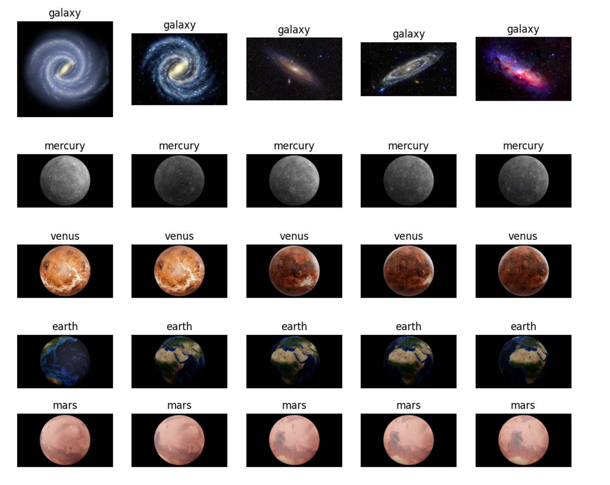

# Astronomical Object Detection  
**Image Classification with KNNs, ANNs, and CNNs**

Authors: Pranit Singh Gandhi, Aarav Agrawal  

---

---

## Overview

This project focuses on classifying astronomical objects from images using classical machine learning and deep learning techniques. Given an input image of a celestial object, the model predicts which of **12 astronomical classes** it belongs to, including planets (Mercury through Pluto), galaxies, asteroids, and black holes.

The motivation behind this work comes from a shared interest in astronomy and applied machine learning. Astronomical images are inherently noisy, heterogeneous, and captured under varying conditions, making them an ideal real-world testbed for comparing different modeling approaches.

We evaluate three families of models:

- **K-Nearest Neighbors (KNN)** with heavy preprocessing and PCA  
- **Artificial Neural Networks (ANNs)** with varying depth and regularization  
- **Convolutional Neural Networks (CNNs)** with different architectural depths  

Our final results show a clear hierarchy in performance, with CNNs significantly outperforming the other approaches.

---

## Dataset

- **Source**: Kaggle (MIT License), originally published by Edoardo Maxia  
- **Total images**: 3,419  
- **Classes**: 12 astronomical objects  
- **Split**:
  - Training: 2,416 images (~70%)
  - Validation: 658 images (~20%)
  - Test: 345 images (~10%)

The dataset includes a mix of grayscale and RGB images, with highly variable resolutions (from a few hundred pixels to nearly 6000×6000).

---

## Preprocessing

All images are resized to **128×128**, converted to tensors, and normalized.

- **CNNs**: Random horizontal flipping for augmentation  
- **ANNs**: Flattened inputs, dropout, batch normalization  
- **KNNs**: Gaussian blur / brightness jitter, feature transformations, PCA  

PCA reduces 49,152 raw pixel features to **75 components**, retaining ~96% of the variance.

---

## Models

### KNN
- Distance-weighted voting
- k ∈ {1, 3, 5, 7, 9, 11}
- Best configuration: **Gaussian Blur + Cubic Features, k=1**

### ANN
- 1, 2, and 3 hidden-layer networks
- ReLU + Adam optimizer
- Best performance achieved with lower learning rates (1e-4)

### CNN
Architectures evaluated:
- Turbo (1 conv layer)
- Lite (2 conv layers)
- Base (3 conv layers)
- Ultra (4 conv layers)

---

## Results

| Model | Test Accuracy | F1 Score |
|------|---------------|----------|
| **CNN Base (λ = 1e-4)** | **94.20%** | **94.33%** |
| KNN (Blur + Cubic, k=1) | 86.67% | 86.37% |
| ANN (1-layer, λ = 1e-3) | 86.02% | 86.11% |

CNNs consistently outperform KNNs and ANNs due to superior spatial feature extraction.

---

## Key Takeaways

- CNNs are best suited for astronomical image classification  
- Depth must be balanced with regularization and learning rate  
- PCA is critical for distance-based models  
- Simple models can perform well with the right preprocessing  

---

## Future Work

- Tune CNN kernel sizes, strides, and dropout rates  
- Experiment with adaptive blur strengths  
- Retrain deeper ANNs with lower learning rates  
- Push CNN accuracy beyond 95%

---

## License

This project is licensed under [custom terms](./LICENSE).  
© 2025 Pranit Singh Gandhi, Aarav Agrawal. All rights reserved.
